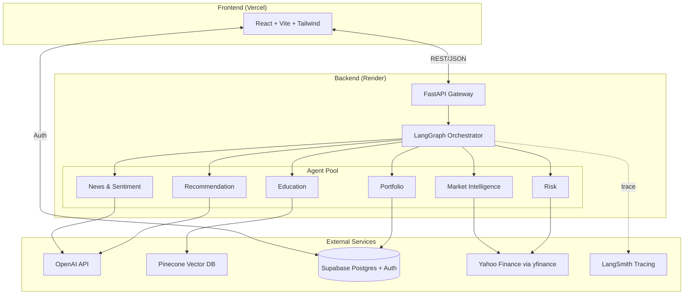

<div align="center">

# 🪙 Finnie AI

### Your AI financial companion — powered by six specialized agents working in concert.

[](https://www.python.org/)
[](https://fastapi.tiangolo.com/)
[](https://reactjs.org/)
[](https://www.typescriptlang.org/)
[](https://github.com/langchain-ai/langgraph)
[](https://opensource.org/licenses/MIT)

**[Live Demo](https://financial-ai-assistant-dqds.vercel.app)** · **[Report Bug](https://github.com/TechProAI/Financial-ai-assistant/issues)** · **[Request Feature](https://github.com/TechProAI/Financial-ai-assistant/issues)**

</div>

---

## Table of Contents

- [About Finnie](#about-finnie)
- [Key Features](#key-features)
- [Architecture](#architecture)
- [The Six Agents](#the-six-agents)
- [Tech Stack](#tech-stack)
- [Project Structure](#project-structure)
- [Getting Started](#getting-started)
- [Environment Variables](#environment-variables)
- [Database Schema](#database-schema)
- [Deployment](#deployment)
- [API Reference](#api-reference)
- [Design Decisions](#design-decisions)
- [Roadmap](#roadmap)
- [Acknowledgments](#acknowledgments)
- [License](#license)

---

## About Finnie

Most financial tools are either dashboards that give you data and leave you to figure it out, or chatbots that give you confident-sounding answers without showing their work. Finnie is built around a different premise: **financial questions deserve specialized reasoning, not a single generalist model.**

Ask Finnie *"Should I be worried about my portfolio's Sharpe ratio?"* and behind the scenes, a Risk agent computes the actual metrics from your holdings, an Education agent explains what the Sharpe ratio means in plain language, and a Recommendation agent stitches it all into a context-aware answer with citations. You see the reasoning chain. You see the data. You can verify the math.

Built as a capstone project to explore what production-grade multi-agent systems look like when designed end-to-end: orchestration, observability, persistence, auth, deployment, and UX.

---

## Key Features

**Conversational Finance** — Chat naturally about stocks, portfolio decisions, financial concepts, or market news. Finnie routes your question to the right specialist agent automatically.

**Portfolio Tracking** — Add holdings (US + Indian markets), and Finnie computes real-time metrics: total value, cost basis, returns, Sharpe ratio, volatility, max drawdown, beta, and annualized return.

**Market Intelligence** — Live quotes and historical charts for US stocks (`AAPL`, `MSFT`, `TSLA`) and Indian NSE/BSE tickers (`RELIANCE.NS`, `TCS.NS`, `INFY.NS`). Watchlist persists across sessions.

**Multi-Agent Reasoning** — Six purpose-built agents (Market Intelligence, Portfolio, Education, News & Sentiment, Risk, Recommendation) coordinated through a LangGraph state machine. Each conversation surfaces which agents fired and why.

**Persistent Chat History** — Sessions, messages, citations, and agent traces are saved to Supabase. Pick up where you left off, switch between conversations, audit past reasoning.

**Citations & Disclaimers** — Every factual claim links back to its source. Financial disclaimers surface automatically — Finnie informs, it doesn't advise.

**Observability** — Full LangSmith tracing on every agent invocation. You can see token usage, latency, tool calls, and intermediate state for every query.

---

## Architecture

Finnie is split into three logical tiers: a React frontend, a FastAPI backend running a LangGraph multi-agent system, and external services (LLMs, vector DB, market data, auth/persistence).



**Request flow:**

1. User sends a message from the React app. Supabase JWT authenticates the call.
2. FastAPI receives the request and invokes the LangGraph orchestrator with the user's message and context (active session, holdings, watchlist).
3. The orchestrator routes through specialized agents in a directed graph. Each agent has a defined role and either calls external tools (yfinance, Pinecone, OpenAI) or transforms intermediate state.
4. The recommendation agent composes the final answer with citations, disclaimers, and an agent trace.
5. Response streams back to the frontend, which renders the answer alongside the reasoning chain. The message is persisted to Supabase.

---

## The Six Agents

Each agent is a focused unit with one job. They share state through the LangGraph `GraphState` object and pass control to one another based on the orchestrator's routing logic.

### 🧠 Market Intelligence

Fetches real-time quotes, historical OHLC data, and basic fundamentals for any ticker. Handles symbol resolution across US and Indian markets (auto-resolves `RELIANCE` → `RELIANCE.NS`, falls back to base symbols when suffixed lookups fail). Produces beginner-friendly summaries of what the data means.

### 💼 Portfolio

Reads the user's holdings from Supabase, fetches current prices for each position, computes position-level and portfolio-level returns, and answers questions about portfolio composition. Powers the dashboard metrics on the Portfolio page.

### 🎓 Education

The RAG agent. When the user asks a conceptual question ("What's a Sharpe ratio?" "How do dividends work?"), it retrieves relevant explanations from a Pinecone vector index of curated finance content and synthesizes a clear answer with citations.

### 📰 News & Sentiment

Pulls recent news for a ticker or sector, summarizes the developments, and produces a sentiment read (bullish/bearish/neutral) with reasoning. Caches per-symbol to avoid hammering news sources.

### ⚖️ Risk

The quant agent. Given holdings, computes Sharpe ratio, volatility (annualized stdev of returns), maximum drawdown, beta vs. benchmark, value-at-risk, and annualized return. Produces a risk profile that's interpretable to non-quants.

### 🎯 Recommendation

The orchestrator's final stop. Takes outputs from upstream agents and weaves them into a coherent, actionable answer. Adds disclaimers, attributes citations, and explicitly avoids buy/sell calls — Finnie informs, doesn't advise.

---

## Tech Stack

| Layer | Tools |
| --- | --- |
| **Frontend** | React 18, TypeScript, Vite, Tailwind CSS, React Router, TanStack Query, Recharts, Lucide Icons |
| **Backend** | FastAPI, Pydantic, Gunicorn + Uvicorn, Python 3.11 |
| **AI/Agents** | LangChain, LangGraph, OpenAI GPT-4 family |
| **Data** | yfinance + curl_cffi (market data), Pinecone (vector DB), Supabase Postgres (app data) |
| **Auth** | Supabase Auth (email/password, JWT) |
| **Observability** | LangSmith (traces, token usage, latency) |
| **Hosting** | Vercel (frontend), Render (backend) |
| **Dev tooling** | ESLint, Prettier, Ruff, Black |

---

## Project Structure

```
Financial-ai-assistant/
├── backend/
│   └── app/
│       ├── agents/             # Six specialized agents
│       │   ├── base.py
│       │   ├── market_intelligence.py
│       │   ├── portfolio.py
│       │   ├── education.py
│       │   ├── news_sentiment.py
│       │   ├── risk.py
│       │   └── recommendation.py
│       ├── api/
│       │   └── routes/         # FastAPI route handlers
│       │       ├── chat.py
│       │       ├── market.py
│       │       ├── portfolio.py
│       │       └── user.py
│       ├── core/               # Exceptions, logging, middleware
│       ├── graph/              # LangGraph orchestration
│       │   ├── state.py
│       │   └── builder.py
│       ├── models/             # Pydantic schemas
│       ├── services/           # External integrations
│       │   ├── market_data.py
│       │   ├── llm_service.py
│       │   ├── pinecone_service.py
│       │   └── supabase_service.py
│       ├── config.py
│       └── main.py
│
├── frontend/
│   └── src/
│       ├── api/                # Backend API clients
│       ├── components/         # Reusable UI components
│       │   ├── market/
│       │   ├── portfolio/
│       │   ├── chat/
│       │   └── ui/
│       ├── context/            # React contexts (Auth, App)
│       ├── lib/                # Supabase client, helpers
│       ├── pages/              # Route-level components
│       ├── types/              # Shared TypeScript types
│       ├── utils/              # Formatters, helpers
│       └── App.tsx
│
├── docs/                       # Architecture notes, deployment guides
├── .env.example
├── docker-compose.yml          # Optional: local dev orchestration
├── requirements.txt
└── README.md
```

---

## Getting Started

### Prerequisites

- **Python** 3.11 or higher
- **Node.js** 18 or higher (we recommend 20+)
- **pnpm** or **npm** for the frontend
- Accounts on: [OpenAI](https://platform.openai.com/), [Pinecone](https://www.pinecone.io/), [Supabase](https://supabase.com/), [LangSmith](https://smith.langchain.com/) (optional but recommended)

### 1. Clone the repo

```bash
git clone https://github.com/TechProAI/Financial-ai-assistant.git
cd Financial-ai-assistant
```

### 2. Backend setup

```bash
cd backend
python -m venv venv
source venv/bin/activate     # Windows: venv\Scripts\activate
pip install -r requirements.txt
cp .env.example .env         # Then fill in your keys (see Environment Variables)
uvicorn app.main:app --reload --port 8000
```

The API will be live at `http://localhost:8000`. Visit `http://localhost:8000/docs` for interactive Swagger docs.

### 3. Frontend setup

In a new terminal:

```bash
cd frontend
pnpm install                 # or: npm install
cp .env.example .env.local   # Then fill in VITE_SUPABASE_URL, VITE_SUPABASE_ANON_KEY, VITE_API_BASE_URL
pnpm dev                     # or: npm run dev
```

App will be live at `http://localhost:5173`.

### 4. Database setup

Run the SQL in `docs/supabase-schema.sql` against your Supabase project to create the required tables and row-level security policies. See [Database Schema](#database-schema) for details.

---

## Environment Variables

### Backend (`backend/.env`)

| Variable | Required | Description |
| --- | --- | --- |
| `OPENAI_API_KEY` | ✅ | OpenAI API key for the LLM agents |
| `PINECONE_API_KEY` | ✅ | Pinecone API key for the Education agent's RAG |
| `PINECONE_INDEX_NAME` | ✅ | Name of your Pinecone index |
| `SUPABASE_URL` | ✅ | Supabase project URL |
| `SUPABASE_KEY` | ✅ | Supabase service-role key (server-side only) |
| `LANGCHAIN_API_KEY` | optional | LangSmith key for tracing |
| `LANGCHAIN_TRACING_V2` | optional | `"true"` to enable LangSmith traces |
| `LANGCHAIN_PROJECT` | optional | LangSmith project name |
| `MARKET_CACHE_TTL_SECONDS` | optional | TTL for in-memory market data cache (default 60) |
| `CORS_ALLOWED_ORIGINS` | ✅ | Comma-separated list of allowed frontend origins |

### Frontend (`frontend/.env.local`)

| Variable | Required | Description |
| --- | --- | --- |
| `VITE_API_BASE_URL` | ✅ | Backend API base URL (e.g. `http://localhost:8000`) |
| `VITE_SUPABASE_URL` | ✅ | Supabase project URL |
| `VITE_SUPABASE_ANON_KEY` | ✅ | Supabase anon/public key |

---

## Database Schema

Finnie uses four core tables in Supabase:

**`sessions`** — chat sessions
```
id (uuid, pk) | user_id (uuid, fk) | title (text) | created_at | updated_at
```

**`messages`** — conversation messages
```
id (uuid, pk) | session_id (uuid, fk) | role (text) | content (text)
citations (jsonb) | agent_trace (jsonb) | disclaimers (jsonb) | extra_data (jsonb)
created_at
```

**`holdings`** — portfolio positions
```
id (uuid, pk) | user_id (uuid, fk) | ticker (text) | quantity (numeric) | avg_cost (numeric) | updated_at
```

**`watchlist`** — tracked tickers
```
id (uuid, pk) | user_id (uuid, fk) | ticker (text) | created_at
```

All tables have **row-level security** policies ensuring users can only read/write their own rows. Full SQL with constraints and indexes is in `docs/supabase-schema.sql`.

---

## Deployment

### Frontend → Vercel

1. Push to GitHub.
2. Import the repo in Vercel; set root to `frontend/`.
3. Add environment variables (`VITE_*`).
4. Deploy. Vercel auto-deploys on every push to `main`.

### Backend → Render

1. Create a new **Web Service** on Render pointing to the `backend/` directory.
2. Build command: `pip install -r requirements.txt`
3. Start command:
   ```bash
   gunicorn app.main:app --workers 2 --worker-class uvicorn.workers.UvicornWorker --bind 0.0.0.0:$PORT --timeout 120
   ```
4. Add all backend env vars from the table above.
5. Deploy.

Alternative deployment guides (AWS EC2 manual setup, Fly.io with Docker) are available in the `docs/` directory.

---

## API Reference

The backend exposes a small, focused REST API. All authenticated routes require a Supabase JWT in the `Authorization: Bearer <token>` header.

### Chat

| Method | Path | Description |
| --- | --- | --- |
| `POST` | `/chat/message` | Send a message; returns the agent's answer with citations and trace |
| `GET` | `/chat/sessions` | List the user's chat sessions |
| `POST` | `/chat/sessions` | Create a new session |
| `DELETE` | `/chat/sessions/{id}` | Delete a session |
| `GET` | `/chat/sessions/{id}/messages` | Fetch messages for a session |

### Market

| Method | Path | Description |
| --- | --- | --- |
| `GET` | `/market/quote/{ticker}` | Real-time quote snapshot |
| `GET` | `/market/history/{ticker}` | Historical OHLC (`?period=3mo&interval=1d`) |
| `GET` | `/market/search` | Symbol search (`?q=apple`) |

### Portfolio

| Method | Path | Description |
| --- | --- | --- |
| `GET` | `/portfolio/holdings` | List user's holdings |
| `POST` | `/portfolio/holdings` | Add or update a holding |
| `DELETE` | `/portfolio/holdings/{ticker}` | Remove a holding |
| `GET` | `/portfolio/analysis` | Compute portfolio-level metrics (Sharpe, vol, drawdown, etc.) |

### User

| Method | Path | Description |
| --- | --- | --- |
| `GET` | `/user/watchlist` | Get watchlist |
| `POST` | `/user/watchlist` | Add ticker to watchlist |
| `DELETE` | `/user/watchlist/{ticker}` | Remove ticker from watchlist |

Full OpenAPI spec is auto-generated at `/docs` (Swagger UI) and `/redoc` when the backend is running.

---

## Design Decisions

A few non-obvious choices, briefly justified:

**Why multi-agent instead of one big prompt?**
Specialized agents reduce prompt complexity, improve reasoning quality on domain-specific tasks (especially math-heavy ones like risk metrics), and make the system debuggable. When something goes wrong, we can trace it to one agent instead of one giant context.

**Why LangGraph specifically?**
We needed graph-based orchestration (not a linear chain) because some queries need parallel agent execution and conditional routing based on intermediate results. LangGraph's state-machine model with typed `GraphState` fits this naturally.

**Why yfinance over a paid API?**
For a capstone project with a free-tier budget, yfinance covers US and Indian markets adequately. It has caveats — most notably rate limiting from cloud IPs — which we handle via curl_cffi browser impersonation and an in-memory TTL cache. For a production version, Twelve Data or Polygon would be the upgrade path.

**Why Supabase instead of just Postgres + custom auth?**
Auth, database, and row-level security in one managed service. Saves ~3 days of plumbing work. The SDK's TypeScript support is excellent on the frontend side.

**Why Pinecone instead of pgvector?**
Pinecone's free tier is generous and the API is simpler than self-hosting embeddings. Trade-off: an additional service to manage. For higher-scale deployment, pgvector inside Supabase would consolidate the stack.

**Why TanStack Query for the frontend?**
Stale-while-revalidate semantics, request deduplication, and built-in caching dramatically reduce the amount of state management code we'd otherwise write for market data fetching.

---

## Roadmap

- [ ] **Streaming responses** — token-by-token streaming from agents to the chat UI for better perceived latency
- [ ] **Voice input** — Whisper-powered voice queries for hands-free use
- [ ] **Options & derivatives** — extend market intelligence to handle options chains
- [ ] **Backtesting agent** — let users test simple "what-if" strategies against historical data
- [ ] **Mobile app** — React Native client sharing the same backend
- [ ] **Multi-currency portfolio** — auto-convert positions across currencies for unified reporting
- [ ] **Custom alerts** — price/volatility threshold alerts via email
- [ ] **Export to PDF** — downloadable portfolio reports

---

## Acknowledgments

- **[LangChain](https://www.langchain.com/) & [LangGraph](https://github.com/langchain-ai/langgraph)** for the agent orchestration framework
- **[Supabase](https://supabase.com/)** for making auth + Postgres painless
- **[yfinance](https://github.com/ranaroussi/yfinance)** for free market data
- **[Recharts](https://recharts.org/)** for the beautiful price charts
- **[Tailwind CSS](https://tailwindcss.com/)** for the design system
- **[shadcn/ui](https://ui.shadcn.com/)** for component patterns and inspiration

---

## License

Distributed under the MIT License. See `LICENSE` for more information.

---

## Disclaimer

Finnie AI is an **educational project**. It is not a licensed financial advisor and nothing it produces should be construed as investment advice. Always do your own research and consult qualified professionals before making financial decisions.

---

<div align="center">

**Built with curiosity by [@Abinesh](https://github.com/TechProAI) — TechProAI Capstone**

⭐ Star this repo if Finnie helped you learn something new

</div>
